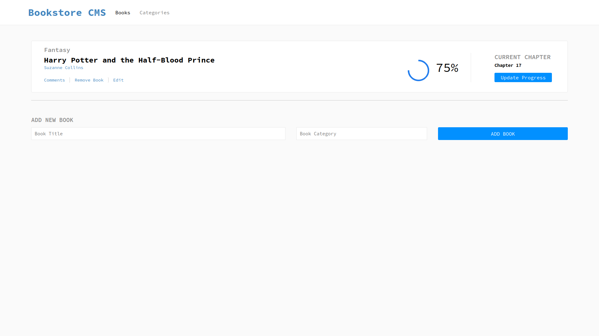

# Book Store

> Project for storing information about the books. Single page application made by using React Redux and API calls.



## Live Demo

[Live](https://luftedar-bookstore.netlify.app/)

## Built With

- React, Redux
- HTML&CSS, JavaScript, NPM
- React and Redux Web Dev Tools

## Getting Started

To get a local copy up and running follow these simple example steps.

Clone the project by using terminal:

```
git clone https://github.com/luftedar/book-store.git
```

cd into the directory:

```
cd book-store
```

install node modules:

```
npm install
```

start live server:

```
npm start
```

### Prerequisites

- Node.
- Code Editor.
- Web Browser.

## Authors

👤 **Orçun Uğur**

- GitHub: [@githubhandle](https://github.com/luftedar)
- Twitter: [@twitterhandle](https://twitter.com/OrcunUgur2)
- LinkedIn: [LinkedIn](https://www.linkedin.com/in/or%C3%A7un-u%C4%9Fur-089148181/)

## 🤝 Contributing

Contributions, issues, and feature requests are welcome!

Feel free to check the [issues page](../../issues/).

## Show your support

Give a ⭐️ if you like this project!

## Acknowledgments

- This project built in Microverse's second module's third week.

## 📝 License

This project is [MIT](./MIT.md) licensed.
